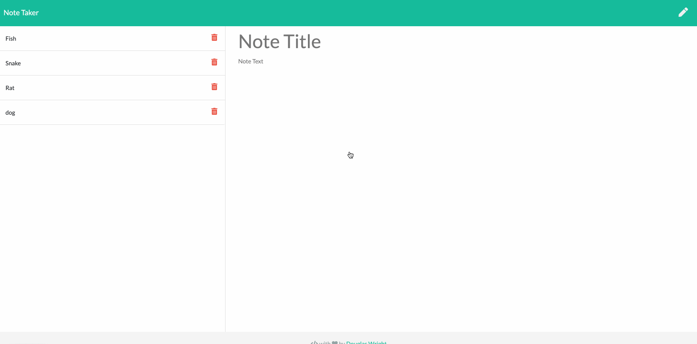
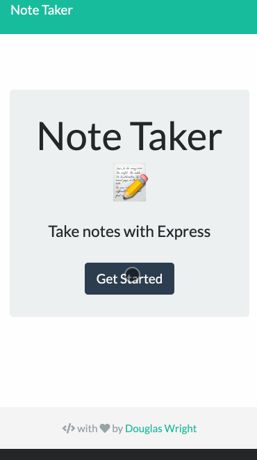

# Express Note Taker
An application that can be used to write, save, uppdate and delete notes (i.e. CRUD). This application uses an express backend and and mimics a DB with a JSON file.

<p align="center">
   
   
</p>

## Installation & Getting Started (remotely)
* [hosted site](https://whispering-brushlands-54134.herokuapp.com/)
* [repo](https://github.com/Spazcool/note-taker)

## Installation & Getting Started (locally)

1. Clone from the [Repo](https://github.com/Spazcool/note-taker): 
  ```
  git clone https://github.com/Spazcool/note-taker.git
  ```
2. Install dependencies:
  ```
  npm install
  ```
3. Run:
  ```
  node app.js
  ```

## Prerequisites

* Node.js

## Built With

* Node
* Express
* Bootstrap
* jQuery
* Heroku

## Authors

* **Douglas Wright** - [Spazcool](https://github.com/Spazcool)

## Acknowledgements

* [Sticky Footer](https://getbootstrap.com/docs/4.0/examples/sticky-footer/) 

## License

This project is licensed under the MIT License - see the [LICENSE.md](LICENSE.md) file for details.
